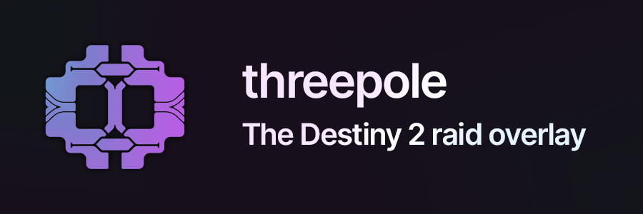

---

## About

Threepole is a clean, minimal raid overlay written in Rust and TypeScript that displays stats about your current raid and raid history.

**Make sure your account visibility is set to public, and that you aren't playing Destiny 2 in fullscreen mode.**

## Features
- No sign-in required (your account needs to be public though)
- Fast-updating and accurate raid API timer
- Displays your daily raid clear count
- Notifications displaying the results of your last raid
- Clean, unintrusive widget located above your minimap
- Easy-to-access configuration and account-switching via the tray icon
- Non-overlay mode (for fullscreeners) and other features coming soon

## Installation

Grab the latest release from this repo's [GitHub releases](https://github.com/dessh/threepole/releases) page.

## Acknowledgements
Thanks to **Giraf**, **Icy**, and the other testers during beta.
